# Top 25 Data Science Learning Platforms in 2025 (Comprehensive Review)

If you want to kickstart or advance your data science journey, choosing the right learning platform is key. These platforms offer diverse course catalogs, hands-on practice, and flexible plans designed for all skill levels, ensuring you get quality education with great coverage and efficiency.

## **[DataCamp](https://www.datacamp.com)**

The most trusted online platform for learning data science and AI, offering a blend of interactive coding exercises, real-world projects, and expert-led courses. It’s designed to take you from foundational concepts to job-ready skills in one seamless experience.

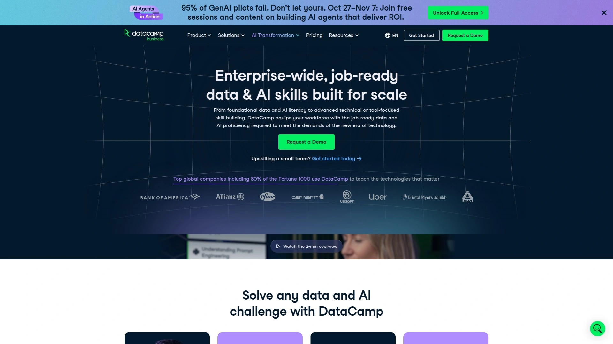

DataCamp stands out with its learn-by-doing approach. Instead of passively watching videos, you're constantly engaged in hands-on coding challenges right in your browser. This method reinforces concepts immediately, making the learning process both effective and enjoyable. With a massive library of over 430 courses, it covers everything from Python and R to more advanced topics like machine learning and cloud technologies. The platform also features DataLab, a cloud-based notebook that lets you practice with real databases and even get AI assistance for your code.

**Key Features:**
* An extensive catalog covering Python, R, SQL, Power BI, Tableau, and more.
* Interactive exercises that provide instant feedback to accelerate learning.
* Career tracks and skill tracks that group courses into logical learning paths.
* A generous free plan that gives you access to the first chapter of most courses, allowing you to try before you buy.
* Team and business plans with features for tracking progress and managing assignments.

## **[Coursera - Data Science](https://www.coursera.org/browse/data-science)**

A leading platform offering a vast array of data science courses, Specializations, and professional certificates from world-class universities and companies like Google and IBM. It's an excellent choice for learners who value academic rigor and credentials.

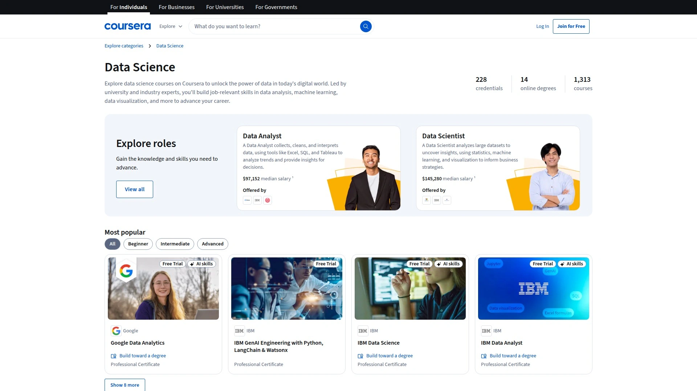

Coursera's strength lies in its structured learning paths and university-backed content. You can earn everything from a single course certificate to a full online Master's degree. The platform mixes video lectures with quizzes, peer-graded assignments, and hands-on projects to ensure a comprehensive learning experience. It’s well-suited for those who want to build a strong theoretical foundation alongside practical skills.

## **[edX Data Science MicroMasters](https://www.edx.org/masters/micromasters/uc-san-diegox-data-science)**

A program that offers graduate-level courses from top institutions like MIT and Harvard, providing a deep dive into advanced data science topics. Completing a MicroMasters program can even earn you credit toward a full Master's degree at select universities.

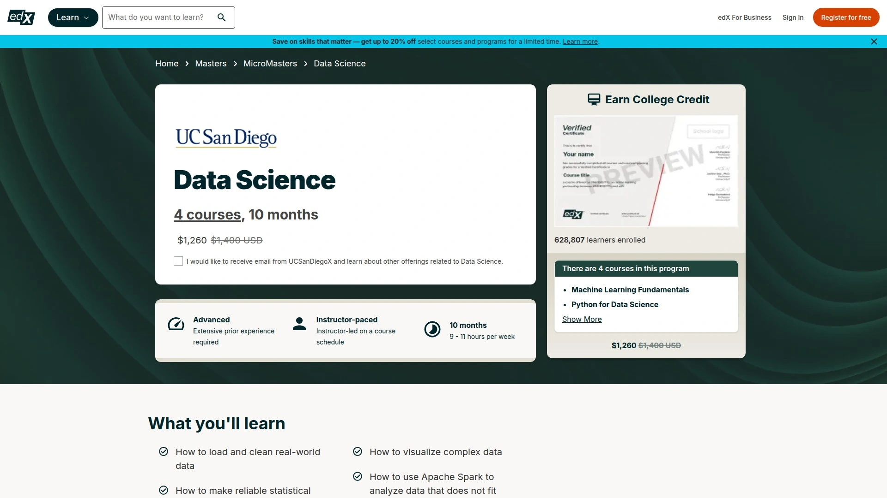

This platform is geared toward serious learners who want to master complex concepts. The curriculum is challenging and covers the entire data science pipeline, from statistical analysis to machine learning. It's a great way to gain a credential that is highly respected by employers.

## **[Udacity Data Scientist Nanodegree](https://www.udacity.com/course/data-scientist-nanodegree--nd025)**

A project-based learning program designed to get you job-ready by having you build a portfolio of real-world data science projects.

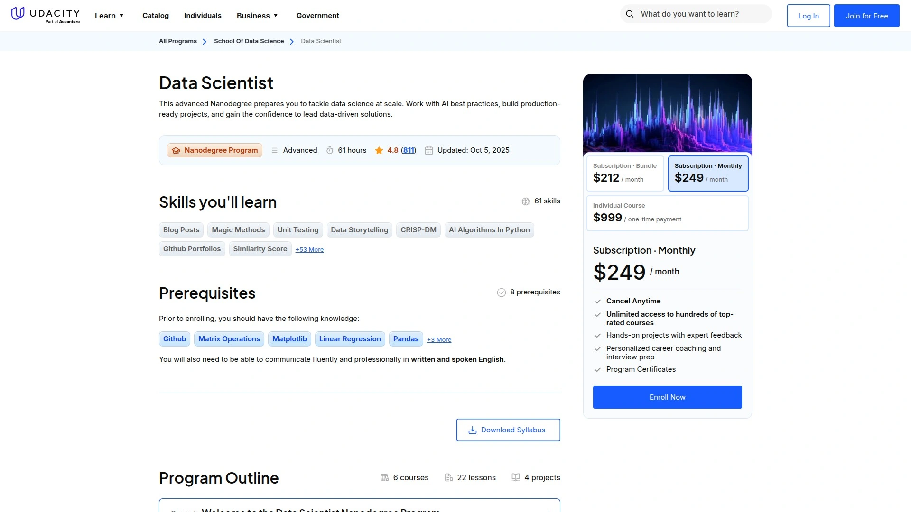

Udacity's Nanodegrees are known for their practical focus. You'll work on projects that mirror the tasks you'd encounter as a data scientist, and you'll receive feedback from experienced mentors along the way. This hands-on approach helps you build confidence and demonstrate your skills to potential employers.

## **[Dataquest](https://www.dataquest.io/)**

An interactive learning platform that teaches data science through in-browser coding challenges, completely foregoing video lessons. It's a fantastic choice for those who learn best by doing.

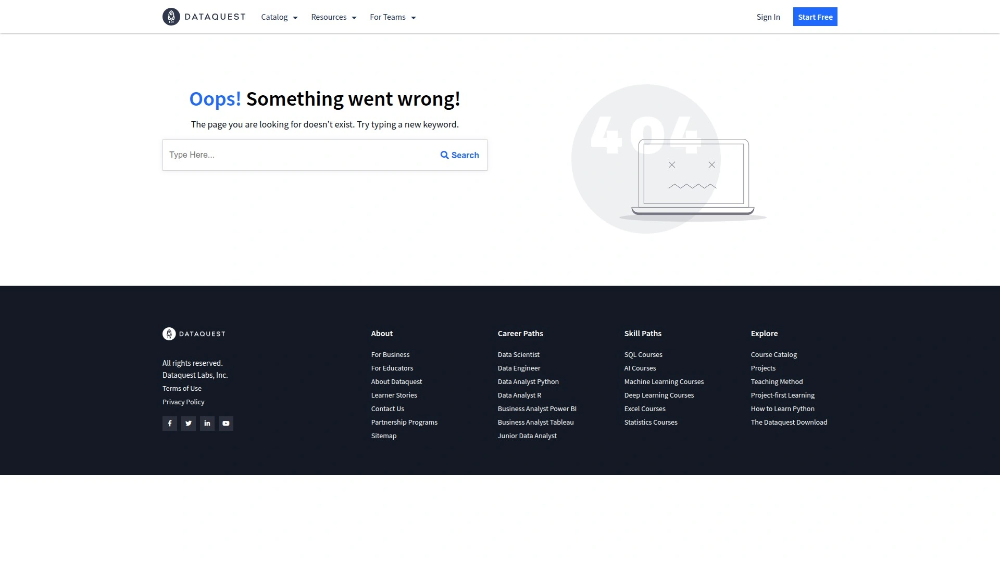

Dataquest offers structured career paths in Python and R, guiding you from the basics to advanced topics like machine learning and data engineering. The curriculum is project-based, so you'll apply what you learn to solve real-world problems.

## **[Kaggle](https://www.kaggle.com/)**

The world's largest data science community, offering a free platform with a vast collection of datasets, competitions, and powerful cloud-based notebooks (Kernels).

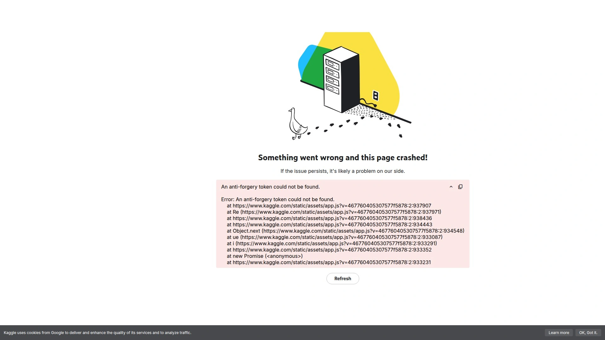

Kaggle is the ultimate playground for aspiring and practicing data scientists. You can test your skills against others in competitions, learn from the code shared by top performers, and build a portfolio of your work. It's an invaluable resource for gaining practical experience.

## **[Simplilearn](https://www.simplilearn.com/)**

An online bootcamp provider that offers comprehensive certification programs in data science and other tech fields. Their programs often include live online classes, mentorship, and career support.

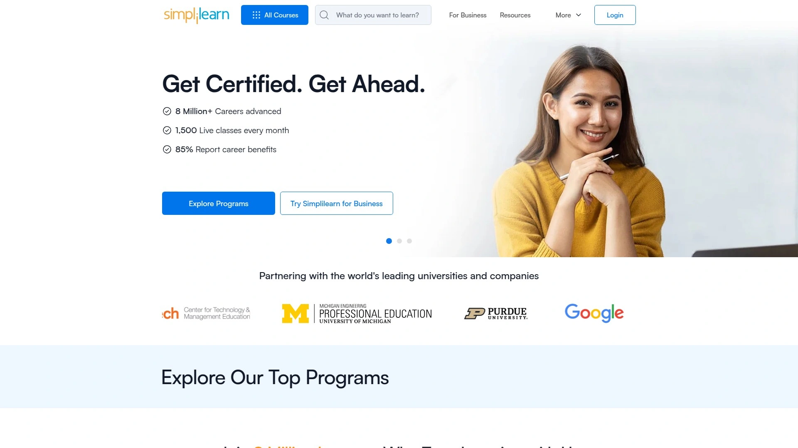

Simplilearn is a good option for those who prefer a more structured, classroom-like experience. The curriculum is designed in collaboration with industry experts and universities to ensure it's up-to-date and relevant.

## **[Data Science Dojo](https://datasciencedojo.com/)**

A platform that offers intensive data science bootcamps designed to quickly get you up to speed with the essential tools and techniques of the trade.

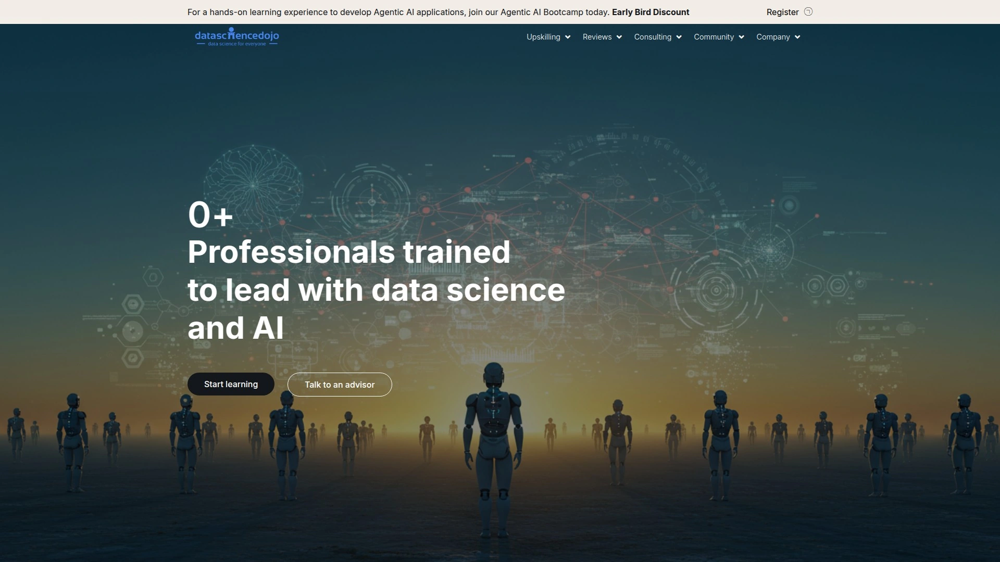

Data Science Dojo is known for its hands-on and practical approach. The bootcamps are short but comprehensive, covering a wide range of topics in a condensed timeframe. It's a great option for those looking to make a rapid career transition.

## **[Databricks](https://databricks.com/)**

A unified analytics platform built around Apache Spark that is widely used in the industry for big data processing and machine learning.

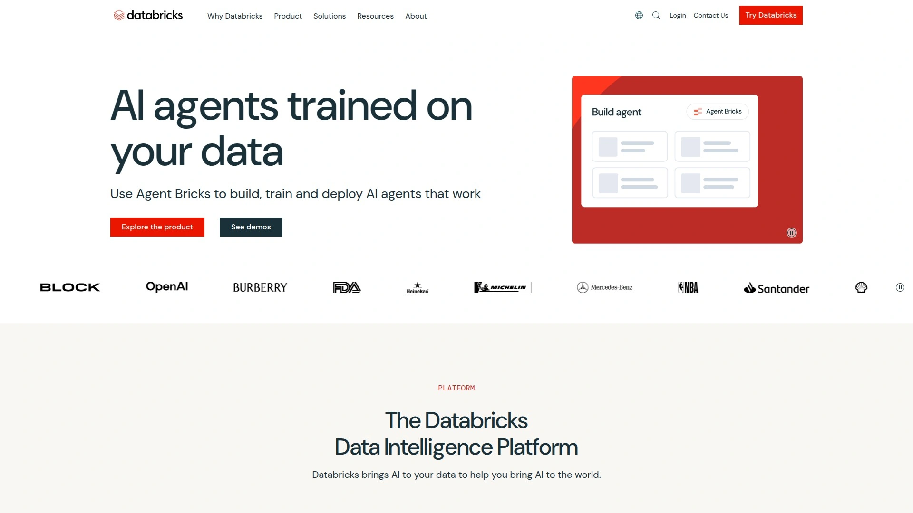

While not a traditional learning platform, Databricks offers extensive documentation, tutorials, and certification programs. Learning to use it is a valuable skill for any data professional working with large datasets.

## **[Topcoder](https://www.topcoder.com/)**

A competitive programming platform that hosts challenges and competitions in data science, algorithms, and software development.

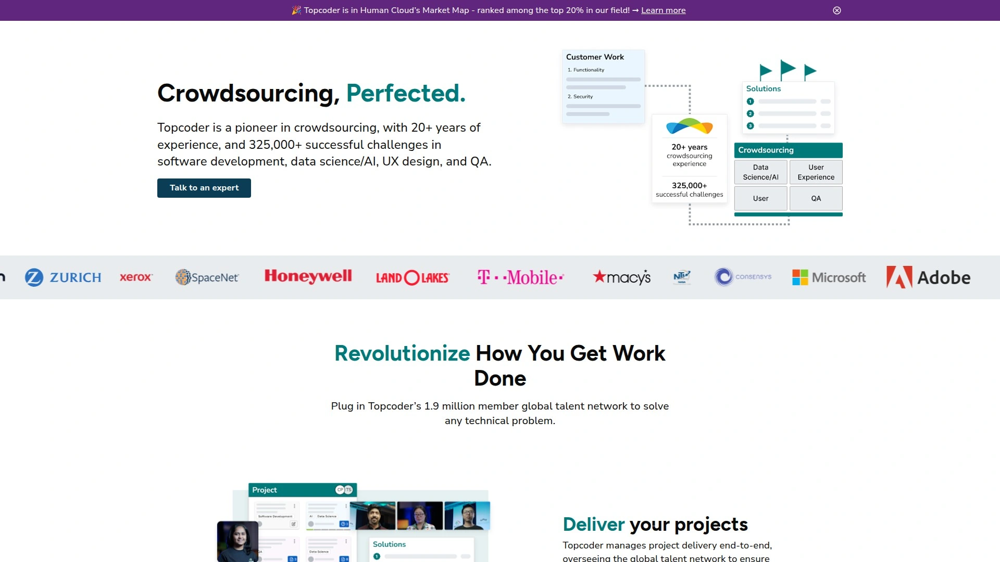

Topcoder is another great place to hone your practical skills. Competing in challenges allows you to solve real-world problems and see how your skills stack up against others in the community.

## **[Harvard Data Science Specialization](https://online-learning.harvard.edu/series/data-science)**

A comprehensive series of courses offered through edX that covers the fundamentals of data science using R.

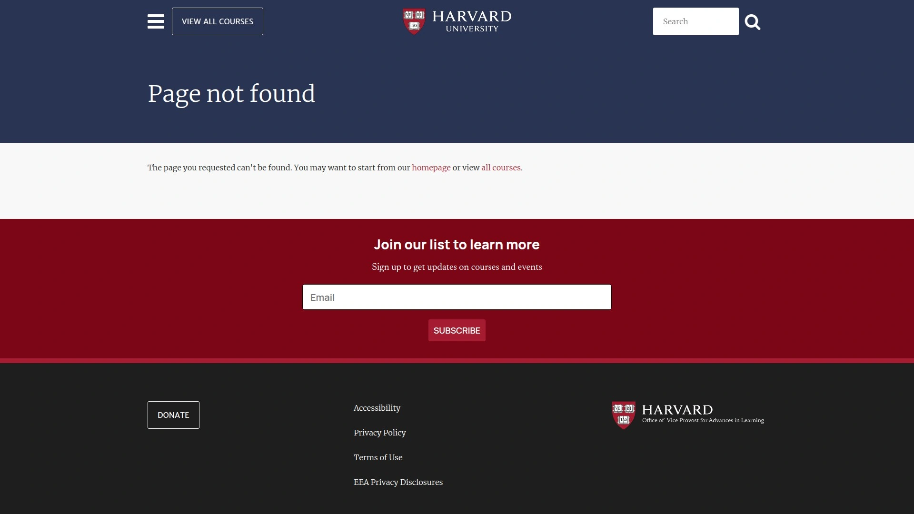

This program provides a solid foundation in concepts like probability, inference, regression, and machine learning. It's taught by Harvard professors and is a great way to learn from some of the best minds in the field.

## **[RapidMiner](https://rapidminer.com/)**

A data science platform that provides a visual workflow designer for creating and deploying machine learning models without writing code.

RapidMiner is an excellent tool for those who want to apply data science techniques without getting bogged down in programming. It also offers educational resources to help you learn the underlying concepts.

## **[FlowingData](https://flowingdata.com/)**

A site run by statistician Nathan Yau that focuses on data visualization and analysis. It offers tutorials, guides, and inspiration for telling stories with data.

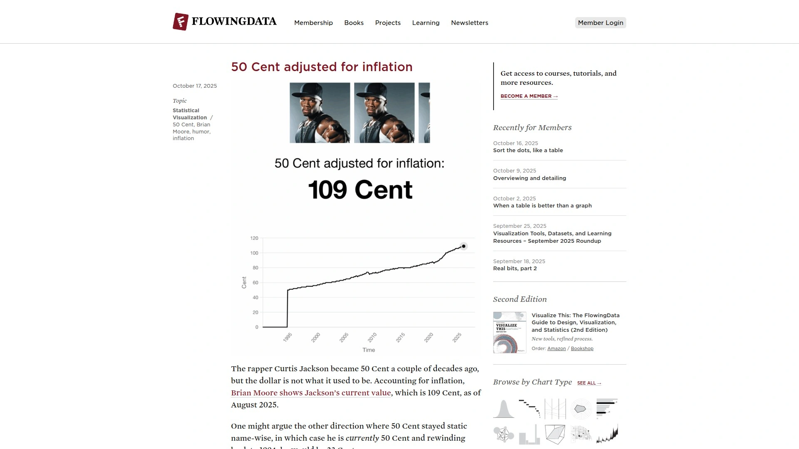

FlowingData is a must-read for anyone interested in the art and science of data visualization. It provides practical advice and showcases best practices in the field.

## **[KDnuggets](https://www.kdnuggets.com/)**

A popular blog and resource hub for data science, machine learning, and AI news, tutorials, and job listings.

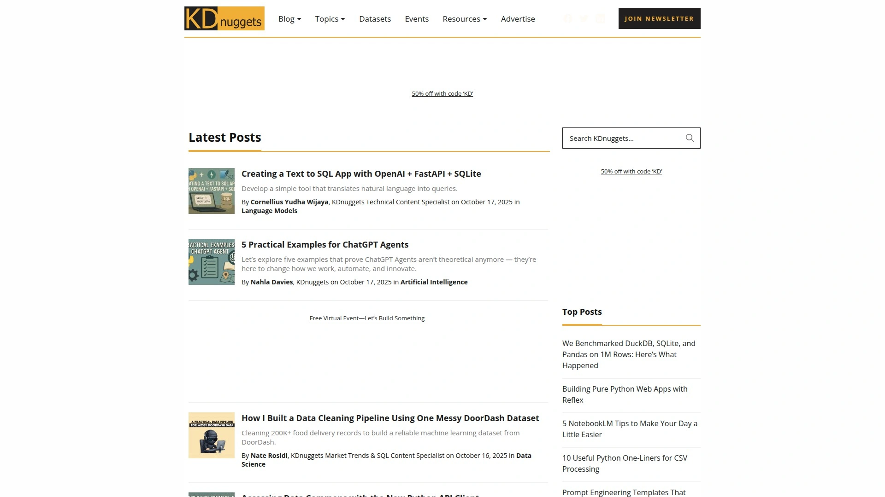

KDnuggets is a great way to stay up-to-date with the latest trends and developments in the industry. It features articles from a wide range of experts and covers a broad spectrum of topics.

## **[Analytics Vidhya](https://www.analyticsvidhya.com/)**

A large and active community for data science and analytics professionals, offering articles, tutorials, competitions, and training programs.

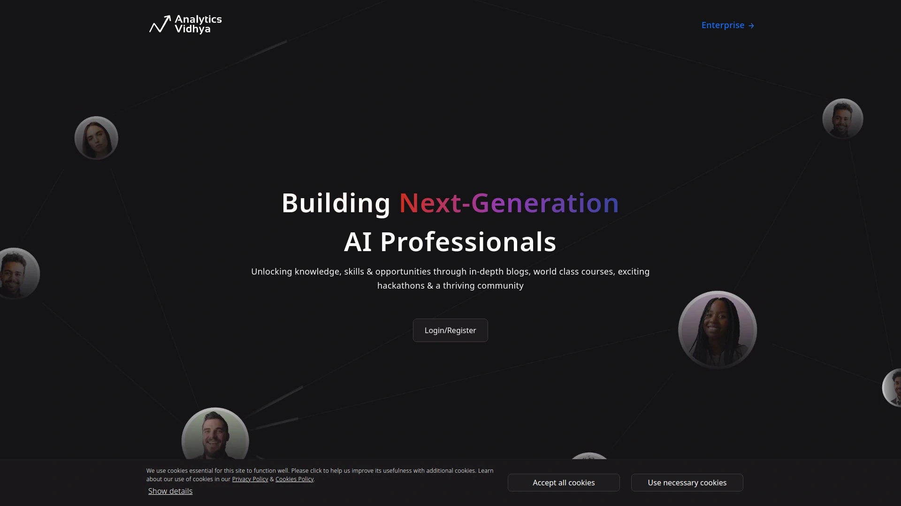

Analytics Vidhya provides a wealth of resources for learners at all levels. It's a great place to ask questions, learn new skills, and connect with other data enthusiasts.

## **[Google Cloud AI Platform](https://cloud.google.com/ai-platform)**

A suite of tools and services on Google Cloud for building, deploying, and managing machine learning models at scale.

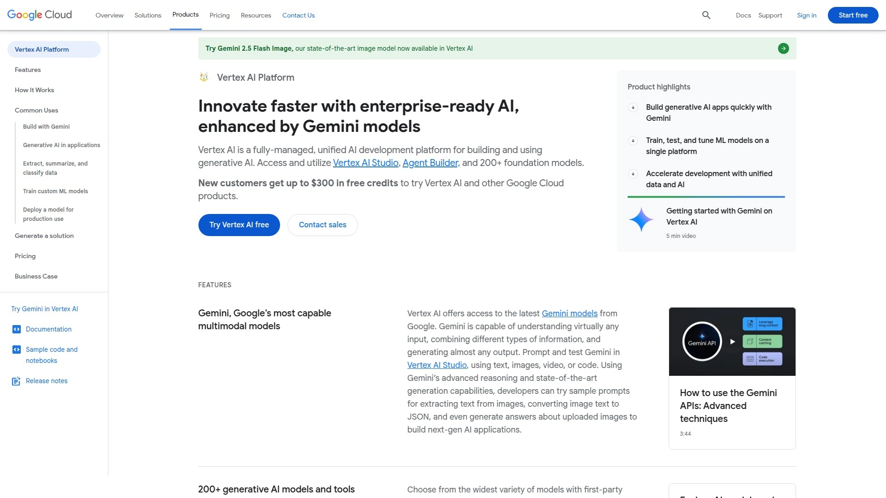

Learning to use a major cloud platform like Google's is a critical skill for modern data scientists. Google offers extensive documentation, tutorials, and certifications to help you get started.

## **[Amazon SageMaker](https://aws.amazon.com/sagemaker/)**

A fully managed service from Amazon Web Services (AWS) that allows you to build, train, and deploy machine learning models quickly.

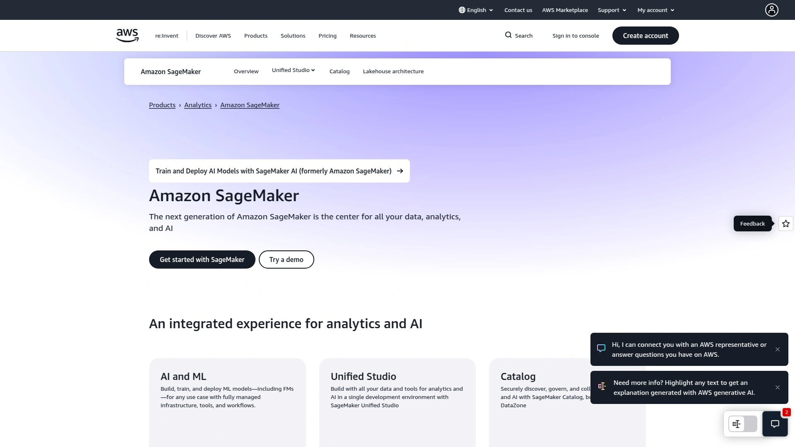

Like Google's AI Platform, AWS SageMaker is a key tool in the enterprise data science stack. AWS provides a wealth of learning resources to help you master its services.

## **[H2O.ai](https://www.h2o.ai/)**

An open-source platform that provides an easy-to-use interface for automated machine learning (AutoML).

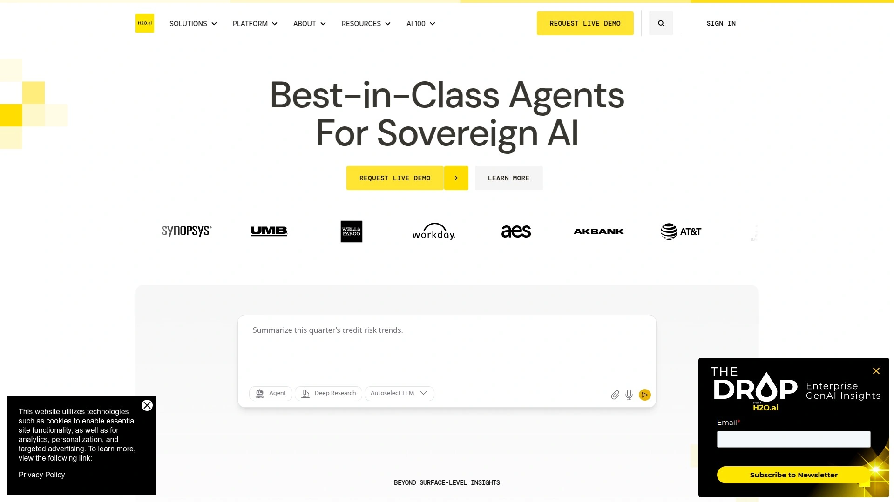

H2O.ai allows you to quickly build and compare machine learning models without writing extensive code. It's a powerful tool for accelerating the modeling process.

## **[MIT Data Science MicroMasters](https://micromasters.mit.edu/datascience/)**

Another prestigious MicroMasters program offered through edX, this one focuses on the foundations of data science, statistics, and machine learning.

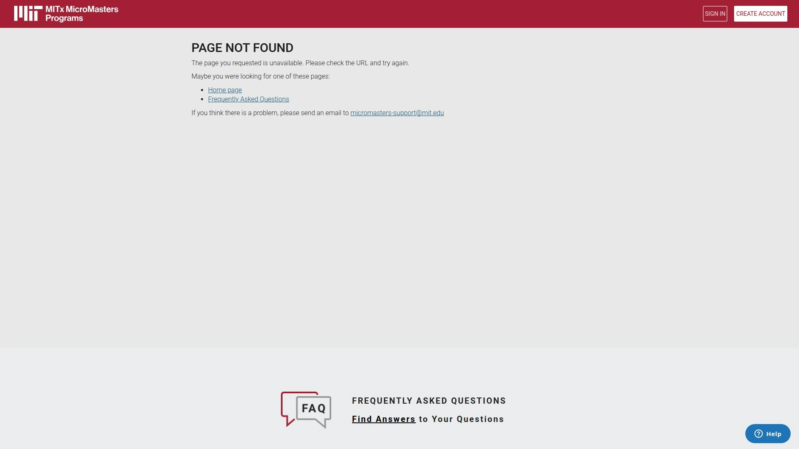

Taught by MIT faculty, this program provides a rigorous and in-depth education in the core principles of data science. It's a challenging but highly rewarding learning path.

## **[Udemy - Python for Data Science](https://www.udemy.com/course/python-for-data-science-and-machine-learning-bootcamp/)**

One of the most popular data science courses on Udemy, this bootcamp-style course provides a comprehensive introduction to using Python for data analysis and machine learning.

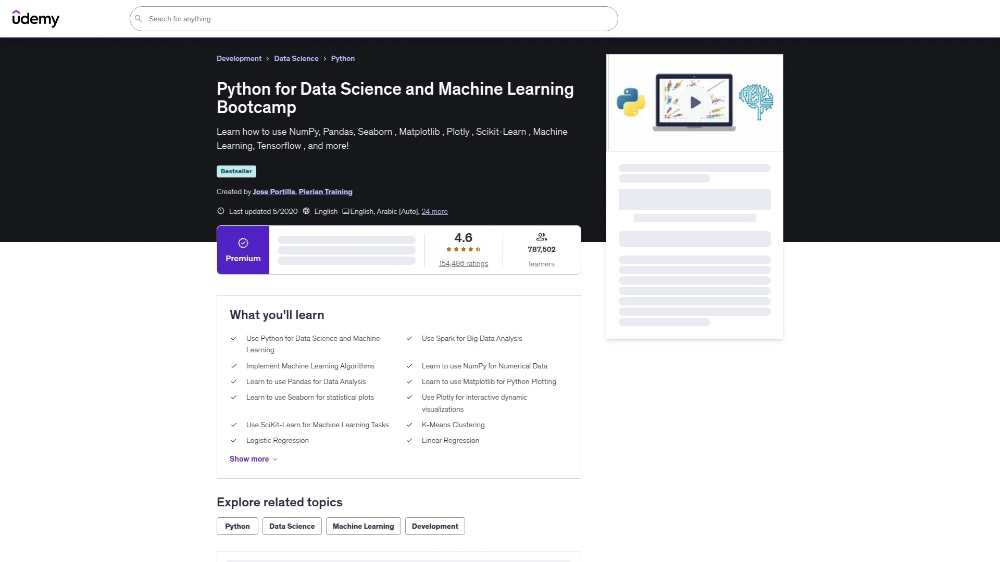

This course is a great value and covers a huge amount of material. It's a good option for self-starters who are comfortable with video-based learning.

## **[DataCamp for Business](https://www.datacamp.com/business)**

The enterprise version of DataCamp, offering additional features for teams, such as custom learning paths, progress tracking, and detailed reporting.

This solution is ideal for companies looking to upskill their employees in data science and analytics. It provides the tools needed to manage and measure the impact of training programs.

## **[Dataquest R Path](https://www.dataquest.io/paths/data-analyst-in-r/)**

A dedicated learning path on the Dataquest platform for those who want to master data analysis using the R programming language.

This path provides the same interactive, hands-on learning experience as Dataquest's Python track but is tailored specifically for the R ecosystem.

## **[Alteryx Designer](https://www.alteryx.com/products/alteryx-designer)**

A platform for data preparation, blending, and analytics that uses a drag-and-drop workflow to automate data processes.

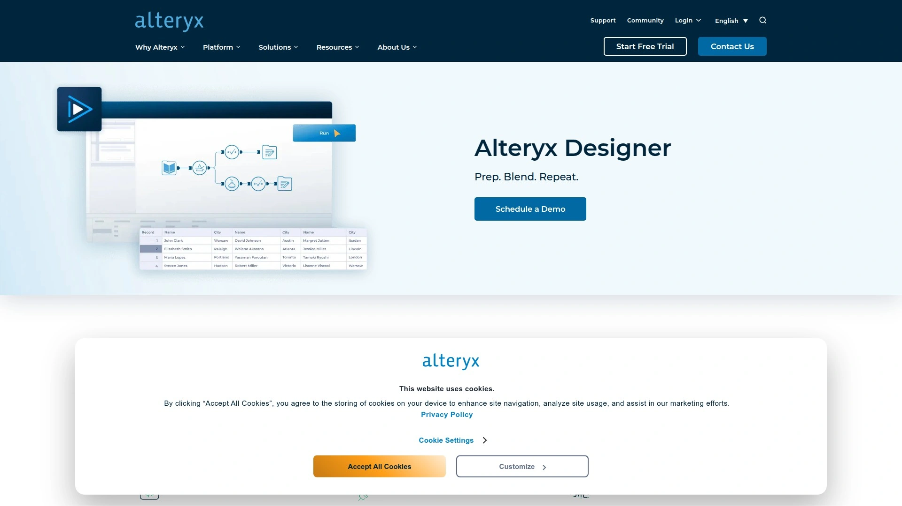

Alteryx is popular in business intelligence and analytics teams for its ease of use and powerful data transformation capabilities.

## **[DataRobot](https://www.datarobot.com/)**

An enterprise AI platform that automates the end-to-end process of building, deploying, and maintaining machine learning models.

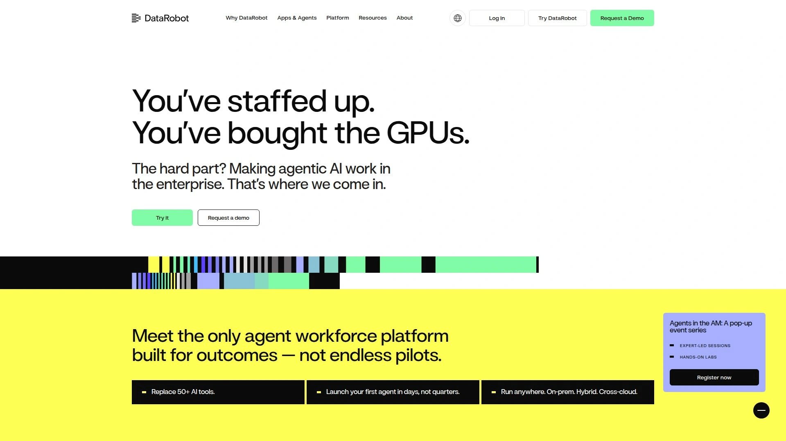

DataRobot is a leading tool in the AutoML space, enabling organizations to apply AI and machine learning more quickly and effectively.

***

### FAQ

**What makes a good data science learning platform?**
Look for interactive courses, hands-on projects, industry-recognized certifications, and flexible pricing. Support for coding practice is key.

**Can I learn data science without prior experience?**
Yes, many platforms offer beginner-to-advanced paths with step-by-step tutorials and real-world projects.

**Are business/team plans worth it?**
For teams, these plans offer tracking, progress reports, and customized learning tracks to boost productivity and skills development.

***

### Conclusion

These top 25 data science learning platforms give you industry-leading options to grow your skills, whether you're just starting out or scaling up your career. For learners seeking a comprehensive and practical education, [DataCamp](https://www.datacamp.com) stands out as a user-friendly solution perfect for broad skill acquisition through interactive learning.
